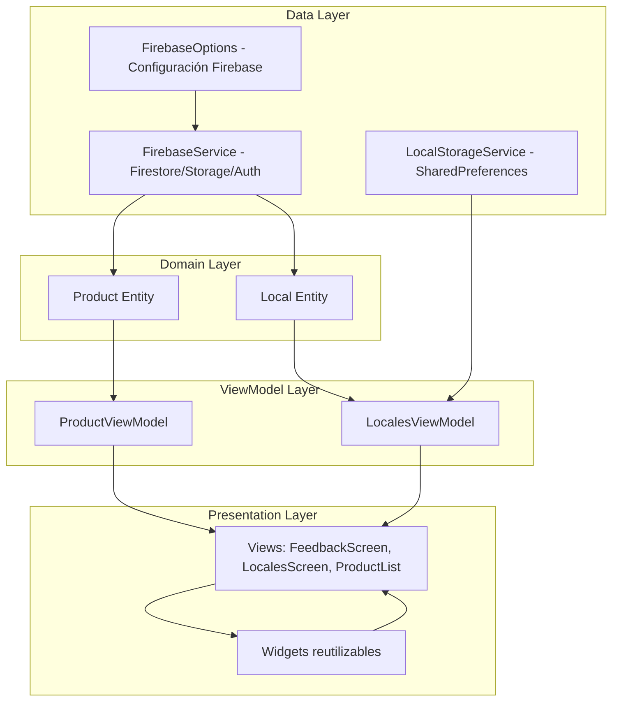
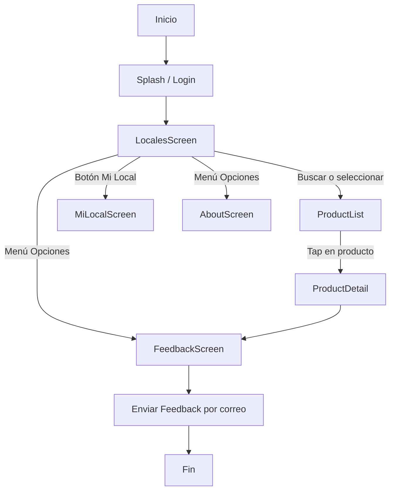
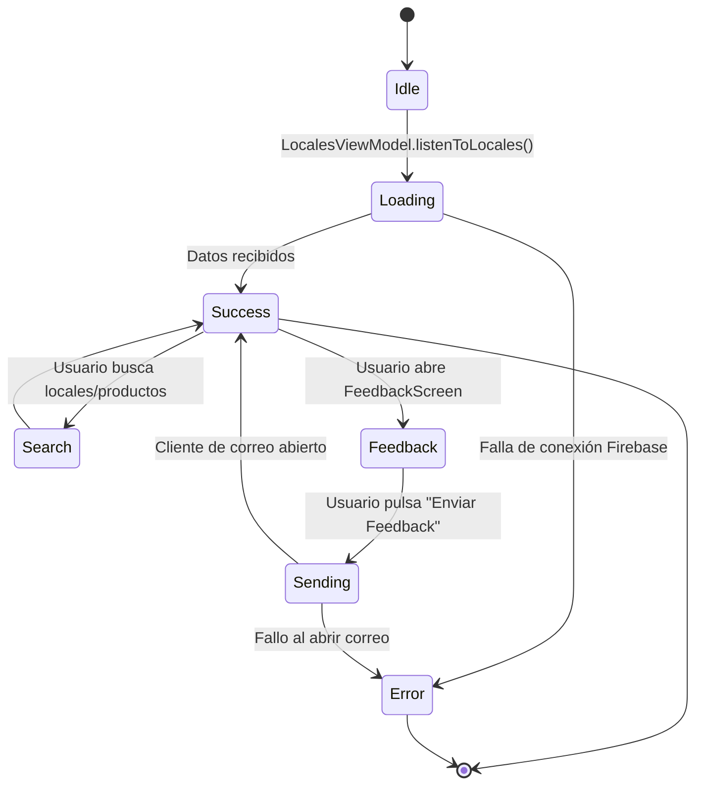
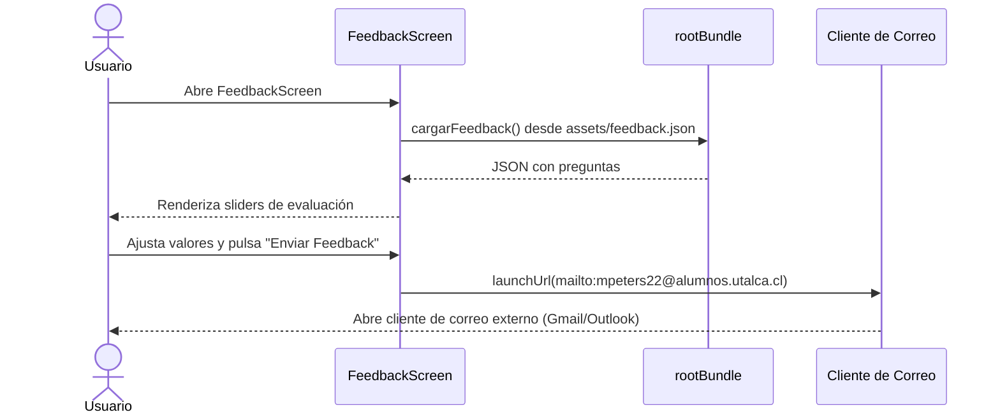
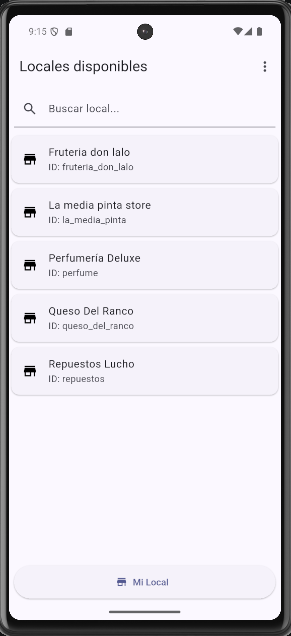
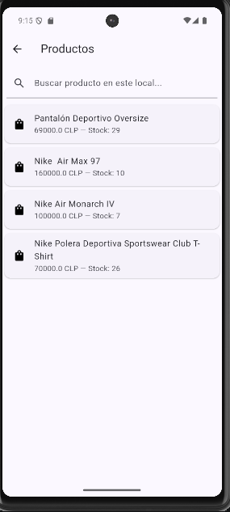
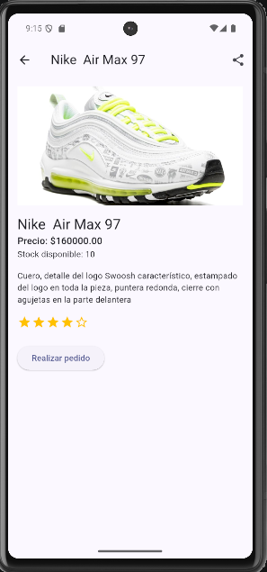
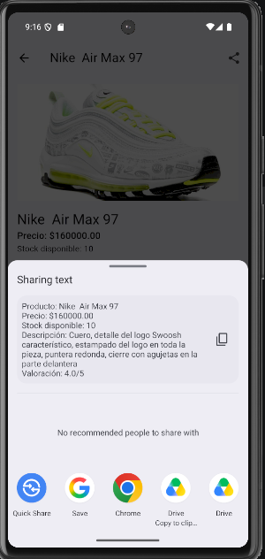
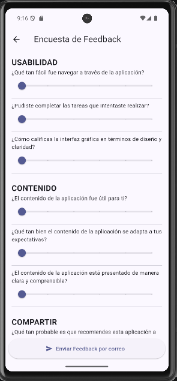

# BizConnect 

Aplicación móvil desarrollada en Flutter bajo el patrón MVVM.
Permite gestionar locales y productos, integrando Firebase (Firestore, Storage, Auth)
y persistencia local con SharedPreferences.

## Características
- Arquitectura MVVM con separación de capas.
- Integración con Firebase (Firestore, Storage, Auth).
- Persistencia local con SharedPreferences.
- Búsqueda local y global de productos.
- Pantalla de Feedback con envío de resultados por correo.
- Identidad digital: Package Name personalizado e ícono nativo.

## Arquitectura MVVM

## Flujo General de la Aplicación

##  Diagrama de Estados

##  Diagrama de Secuencia - Feedback

## QA / Beta Testing - Resultados de Feedback

Se aplicó un instrumento JSON con 9 preguntas distribuidas en tres categorías: *Usabilidad*, *Contenido* y *Compartir*.
Los resultados fueron recolectados vía correo electrónico desde 5 participantes: Javier Molina, María José, Franco Navarrete, David y Daniel Gustavo.

###  Respuestas Individuales

| Categoría  | Pregunta | Javier | María José | Franco | David | Daniel | Promedio |
|---|---|---|---|---|---|---|---|
| Usabilidad | ¿Qué tan fácil fue navegar a través de la aplicación? | 5 | 4 | 4 | 3 | 3 | **3.8** |
| Usabilidad | ¿Pudiste completar las tareas que intentaste realizar? | 5 | 5 | 4 | 3 | 4 | **4.2** |
| Usabilidad | ¿Cómo calificas la interfaz gráfica en diseño y claridad? | 2 | 3 | 4 | 3 | 4 | **3.2** |
| Contenido | ¿El contenido de la aplicación fue útil para ti? | 4 | 3 | 4 | 3 | 5 | **3.8** |
| Contenido | ¿Qué tan bien se adapta a tus expectativas? | 3 | 4 | 4 | 3 | 5 | **3.8** |
| Contenido | ¿Está presentado de manera clara y comprensible? | 4 | 3 | 4 | 3 | 4 | **3.6** |
| Compartir | ¿Qué tan probable es que recomiendes la aplicación? | 3 | 2 | 4 | 3 | 4 | **3.2** |
| Compartir | ¿Cómo te sentirías al compartirla con alguien más? | 2 | 4 | 4 | 3 | 4 | **3.4** |
| Compartir | ¿Crees que sería útil para personas cercanas? | 1 | 2 | 4 | 3 | 4 | **2.8** |

###  Resultados Cuantitativos (Promedio por categoría)

| Categoría | Promedio |
|---|---|
| Usabilidad | 3.73 |
| Contenido | 3.73 |
| Compartir | 3.13 |

###  Observaciones Cualitativas
- **Fortalezas:**
  - La mayoría pudo completar las tareas sin problemas (promedio más alto del instrumento, 4.2).
  - El contenido fue considerado útil y relevante, con buena adaptación a expectativas.
  - El envío de feedback por correo funcionó correctamente.
- **Debilidades:**
  - La interfaz gráfica mostró alta dispersión (2 a 4 entre participantes), indicando inconsistencia en la percepción visual.
  - La disposición a recomendar o compartir la aplicación fue la categoría con menor puntaje promedio (Compartir, 3.13).
- **Trabajos futuros:**
  - Mejorar consistencia visual y diseño de la interfaz.
  - Optimizar la búsqueda global para mayor rendimiento.
  - Añadir incentivos o mejoras en la experiencia de compartir.

###  Conclusión
El prototipo cumple con los requisitos de QA: se aplicó un instrumento formal, se recolectaron respuestas reales de 5 participantes y se documentaron resultados cuantitativos y cualitativos. Esto evidencia la validación con usuarios externos y la retroalimentación para mejoras futuras, identificando la interfaz visual y la disposición a compartir como las áreas de mayor oportunidad.

## Instalación (si no se tiene el APK)
1. Clonar el repositorio.
2. Ejecutar `flutter pub get`.
3. Instalar APK desde `release/bizConnect.apk`.

## Recursos Multimedia
- [Video de exposición técnica](https://youtu.be/98hLvJolCqE)

###  Capturas de pantalla

#### LocalesScreen

### ProductList

#### Product

#### ShareProduct

#### FeedbackScreen

