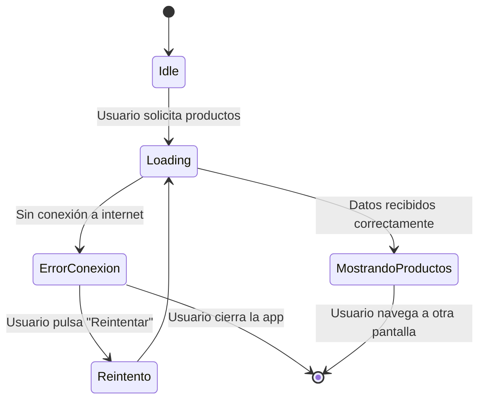
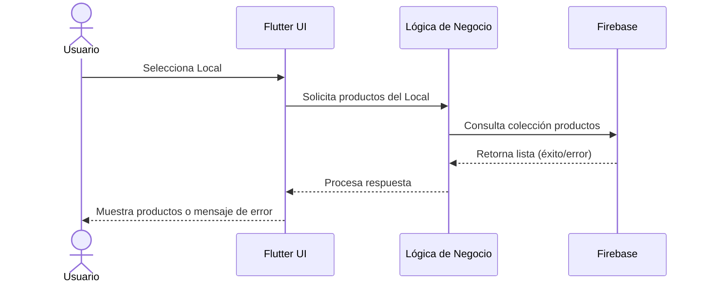

## 📊 Diagramas del Sistema

### 1. Diagrama de Estados (Ciclo de Vida de Carga de Productos)

```mermaid
stateDiagram-v2
    [*] --> Idle

    Idle --> Loading: Usuario solicita productos
    Loading --> ErrorConexion: Sin conexión a internet
    Loading --> MostrandoProductos: Datos recibidos correctamente

    ErrorConexion --> Reintento: Usuario pulsa "Reintentar"
    Reintento --> Loading

    ErrorConexion --> [*]: Usuario cierra la app
    MostrandoProductos --> [*]: Usuario navega a otra pantalla
```

### 2. Diagrama de Secuencia (Consulta de Productos por Local)

```mermaid
sequenceDiagram
    actor Usuario
    participant UI as Flutter UI
    participant Dominio as Lógica de Negocio
    participant Datos as Firebase

    Usuario->>UI: Selecciona Local
    UI->>Dominio: Solicita productos del Local
    Dominio->>Datos: Consulta colección productos
    Datos-->>Dominio: Retorna lista (éxito/error)
    Dominio-->>UI: Procesa respuesta
    UI-->>Usuario: Muestra productos o mensaje de error
```
